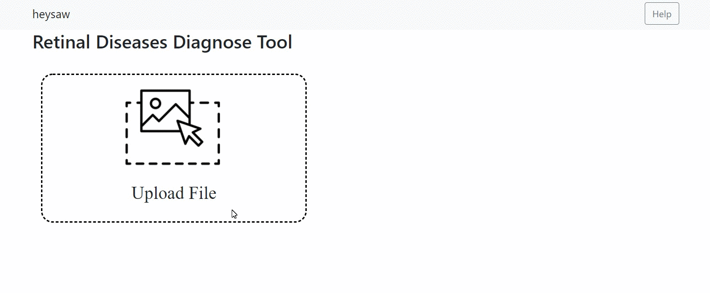
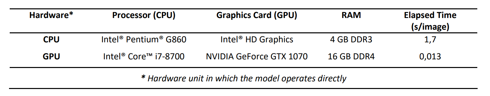
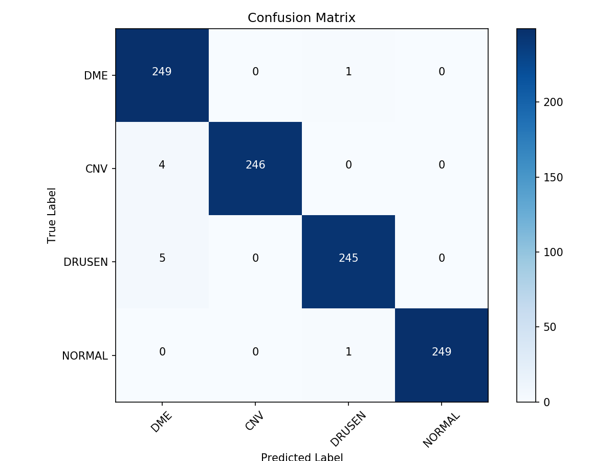

# heysaw   [](https://travis-ci.com/Goodsea/heysaw) [](https://doi.org/10.5281/zenodo.3333946) [](https://www.gnu.org/licenses/agpl-3.0)
 Retinal Diseases (CNV, DME, DRUSEN, NORMAL) Diagnoses Tool

## Introduction 
#### Why do we use OCT Images?
Optical Coherence Tomography (OCT) provides ophthalmologists with a great convenience in the diagnosis and follow-up of macular diseases. The OCT uses light waves to display the retinal section in detail while shooting. During this process, X-rays and radiation of sufficient magnitude that may have a negative effect on patients are not emitted. OCT is also preferred in the field of ophthalmology since it provides real-time and non-invasive imaging.

#### What is the importance of CNV, DME, DRUSEN diseases?
Age-Related Macular Degeneration (AMD) occurs as a result of the inactivation and degeneration of photoreceptor cells in the macula. AMD; It is a disease that affects “central sharp vision” in reading, sewing and driving, and is one of the leading causes of irreversible vision loss. DRUSEN is a characteristic finding that plays a key role in the transition to the advanced stages of AMD. Therefore, slowing or stopping AMD can be achieved by early detection of DRUSEN disease. In most AMD cases, visual loss occurs due to choroidal neovascularization (CNV) in the subfoveal region. According to a study of young patients, 62% of people with myopia have CNV disease at the same time. Since CNV is usually subfoveal, CNV needs to be treated to maintain central vision. Another major cause of visual impairment is Diabetic Macular Edema (DME). DME is a disease caused by the destruction of the internal blood-retinal barrier. 

### The Main Aim of <i>heysaw</i> Project
Equally to all people in the world; providing fast, high accurate, easy-to-use and free medical softwares. <br>
<p align="center"><i>"Goodness Is All You Need"</i></p>

## Demo


## Install Dependecies
#### Create Conda environment and activate it <br>
 <code>conda create -n heysaw python=3.6</code> <br>
 <code>conda activate heysaw</code> <br>
<hr>

#### Download codes <br>
 <code>git clone https://github.com/Goodsea/heysaw </code> <br>
 <code>cd heysaw</code> <br>
<hr>

#### Install dependecies for CPU <br>
 <code>pip install -r requirements_cpu.txt</code> <br><br>
#### Install dependecies for Nvidia-GPU (required CUDA and CUDNN) <br>
 <code>pip install -r requirements_gpu.txt</code> <br>
<hr>

#### Run the best pretrained model on localhost. <br>
 <code>python app.py</code>
 
#### Arguments Options
```
 --width    INT      Target Image Width.        Default is 256.                      ### Target Image Shape \
 --height   INT      Target Image Height.       Default is 256.                      ### must compatible    \
 --channel  INT      Target Image Channel.      Default is 1.                        ### with model.        \
 --path     STR      Best Model Location Path.  Default is `models/heysaw_fold_1.h5`.
 --save     BOOL     Save Uploaded Image.       Default is False.                    # Reduce storage usage.
 --port     INT      WSGIServer Port Number.    Default is 5000.                     # Make sure there is no port conflict.
```

## Dataset
<i> "Labeled Optical Coherence Tomography (OCT) and Chest X-Ray Images for Classification" (Version 2) (OCT2017.tar.gz) Dataset was used in this project. </i><br>

Citation:
<code>http://dx.doi.org/10.17632/rscbjbr9sj.2</code> </br>
<code>Kermany, Daniel; Zhang, Kang; Goldbaum, Michael (2018), “Labeled Optical Coherence Tomography (OCT) and Chest X-Ray Images for Classification”, Mendeley Data, v2</code>


## Performance
### Training - Validation Losses
<table width="100%" border="0">
  <tr>    
  <td></td>
  <td></td>
  <td></td>
  </tr>
  <tr>    
  <td></td>
  <td></td>
  <td></td>
  </tr>
</table>

### Basic CPU-GPU Speed Comparison


### Confusion Matrix
<center></center>

## License
This project is licensed under the GNU Affero General Public License v3.0 - see the <a href="LICENSE.md">LICENSE.md</a> file for details.

## Acknowledgements
- <a href="https://arxiv.org/pdf/1709.01507.pdf" target="_blank">Squeeze-and-Excitation Networks</a>
- <a href="https://arxiv.org/pdf/1608.03983.pdf" target="_blank">SGDR: Stochastic Gradient Descent With Warm Restarts</a>
- <a href="https://github.com/mtobeiyf/keras-flask-deploy-webapp" target="_blank">keras-flask-deploy-webapp</a>, This repository is the skeleton of the <i>heysaw</i> web application.
- <a href="https://github.com/JudasPriestBAE" target="_blank">JudasPriestBAE</a>, <i>heysaw</i> Name Founder.
